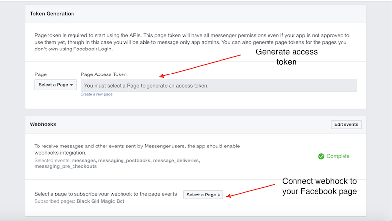

# 

## Overview
EZPZ is a program that enables automated form filling in English by answering the questions in the form in any language. A user is presented with human readable questions in their language of choice and finally a pdf version of the form filled in English is produced.
The front end is implemented as a Facebook messenger bot, however the hooks should work with any interactive messaging api (Twilio, Hangouts, Telegram, etc.).
The back end is the pdf_parser module which parses and fills out the pdf.

## Why?
We wanted to create something to help with the daunting task of tackling bureaucracy from the perspective of someone who is not most comfortable with English (often these are the people who are confronted by such bureaucracy the most).

## Dependencies
- `python 3.6`
- `pip`
- `flask` 
- `google-cloud-storage`
- `pymessenger` 
- `pdfrw`
- `twilio`

## Required setup
1. python 3.6
2. python dependencies (above)
3. Access tokens for Google Translate and Language Recognition APIs, and for Facebook Messenger API
4. You must have a Facebook page set up linked as an app at developer.facebook.com

### How to setup the bot on Facebook
1. Create a Facebook page for your app
2. Once you’ve made a page, go to the Facebook for Developers website and create a developer account
3. Create a new app
4. Setup messenger in the `select product` menu 
5. Generate the Access Token for the Facebook Page in the Messenger tab
6. Paste your token in the code
7. Set the following webooks: `messages`, `messaging_postbacks`, `message_deliveries`, `messaging_pre_checkouts`,`boxes`
8. Provide a valid public https address from which you will be hitting your flask application (you can use ngrok to test locally)
- 

## How to run
- `python3 app.py`

### Intended bot flow
- User messages bot
- Bot recognizes the language the user is using in the first message and will interact using that language
- Bot presents the user with the available pdf forms it can assist with
- User selects form
- Bot reads the prompts in the pdf, massages them into a more approacheable form (i.e. "First Name" => "What is your first name?") and presents them to the user in the selected language
- User responds to prompts one by one in their own language
- Bot records the user's responses and translates them back into English for filling in the form
- Bot provides a url to a pdf version of the form filled in with answers translated to English
- Optional: user may provide phone number for the bot to text the url to

## Authors
- Alon Ezer
- Eden Dolev
- Jonathan Bofman
- Tomer Aharoni

## Future work
This is still a POC project. It will require more work to bring to a robust state
- Cover edge and error cases
- Response edits
- More bot integrations (twilio, telegram, etc.)
- Preprocess more forms
- Dynamic, automated pdf preprocessing using image recognition (hard since bureaucratic forms vary wildly between one another)
- More...
